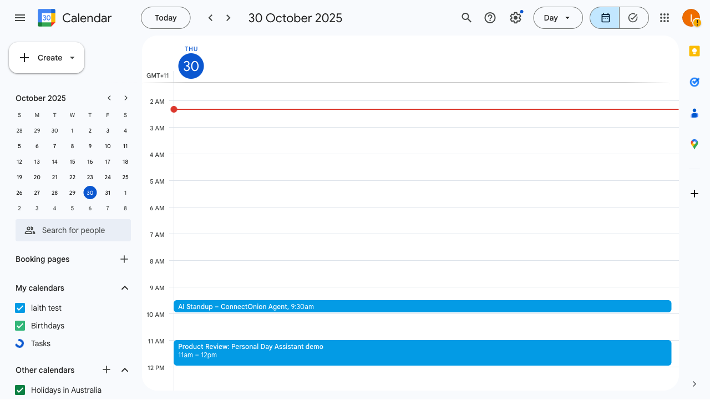
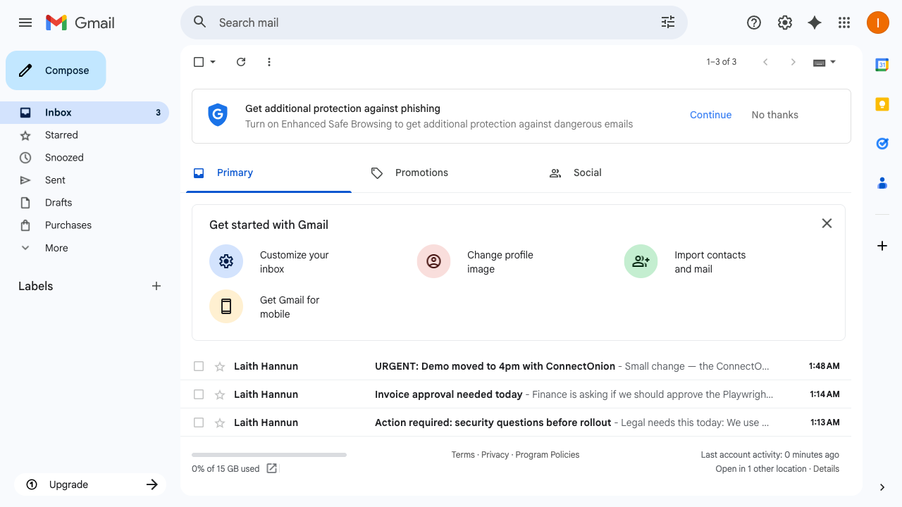
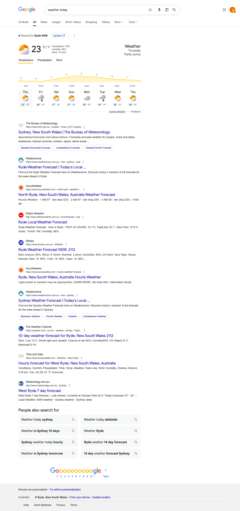

# 🗓️ Personal Day Assistant (ConnectOnion + Playwright)

A one-click **browser agent** that opens **Google Calendar**, **Gmail**, and **Weather** in a real Chrome window, **screenshots** them, then returns a clean **daily brief** in a simple web UI.

- ✅ Real Chrome via **Playwright** (not a headless bot lookalike)
- ✅ Reuses a **persistent profile** so your Google login stays signed in
- ✅ Captures **all meetings today** (agenda view) + **top unread emails** + **today’s weather**
- ✅ Summarises to a friendly text block and shows the screenshots
- ✅ Built to demo **ConnectOnion “natural-language browser”** capability

<p align="center">
  <!-- Replace with your uploaded demo URL after you add it (Issues → New → attach video OR use repo "New video" flow) -->
  <a href="https://youtu.be/iiMtHuNgY1U">
    
  </a>
  <br/>
  <em>Click the image to watch a short demo (GitHub-hosted video).</em>
</p>

---

## ✨ What it does

1. Launches Chrome with a **persistent profile** (`./chrome-profile`).
2. Goes to **Google Calendar** → switches to Day/Agenda → screenshots → extracts today’s meetings.
3. Goes to **Gmail** → screenshots → parses **unread** threads (top N).
4. Searches **“weather today”** on Google → screenshots → extracts temp + condition.
5. Generates a **summary** and renders everything in `/dashboard`:





---

## 🧱 Project structure

```
agent-day-planner/
├─ app.py                 # Flask app serving / and /dashboard
├─ agent.py               # High-level DayPlannerAgent + summary logic
├─ web_automation.py      # Playwright automation (calendar/inbox/weather)
├─ prompt.md              # (optional) agent prompt notes
├─ connectionion.md       # (optional) ConnectOnion notes
├─ requirements.txt
├─ templates/
│  └─ dashboard.html      # Minimal, clean UI
└─ screenshots/           # Output images (auto-created)
   ├─ calendar_today.png
   ├─ inbox_unread.png
   └─ weather.png
```

> The directory `chrome-profile/` is created automatically on first run and **keeps your Google session** so you don’t have to log in each time.

---

## 🚀 Quick start

> Requires Python 3.10+ and Chrome installed.

```bash
# 1) Clone & enter
git clone https://github.com/<your-username>/agent-day-planner.git
cd agent-day-planner

# 2) Python env
python -m venv venv
source venv/bin/activate   # Windows: venv\Scripts\activate

# 3) Install deps
pip install -r requirements.txt

# 4) Install Playwright browsers (Chrome)
playwright install
playwright install-deps    # Linux only

# 5) Run the app
python app.py
```

Open: **http://localhost:5000** → click **“Plan My Day”**.

### First run: sign in to Google
- A real Chrome window launches. Sign in to **Calendar** and **Gmail** once.
- Your session is saved in `./chrome-profile/`. Next runs won’t ask again.

---

## 🧠 How it works (flow)

```text
Flask (/dashboard)
   └── DayPlannerAgent.run_day_plan()
         ├── WebAutomation.capture_calendar()  → calendar_today.png + parsed items
         ├── WebAutomation.capture_inbox()     → inbox_unread.png + parsed senders/subjects
         ├── WebAutomation.capture_weather()   → weather.png + parsed temp/conditions
         └── summarize_with_llm()              → compact human summary (rule-based)
```

- **Calendar parsing**: tries Day/Schedule/Agenda view; collects visible items for **today**.
- **Gmail parsing**: collects the **unread** rows (`tr.zA.zE`) and shows top N (configurable).
- **Weather parsing**: grabs `#wob_tm` + `#wob_dc` from Google’s weather card.

---

## ⚙️ Configuration

In `web_automation.py`:

- `UNREAD_LIMIT = 5` – change how many unread emails to show.
- `CALENDAR_MAX_EVENTS = 10` – change how many events to parse from the Day/Agenda view.
- **Profile path** (default `chrome-profile`) – change if you want separate profiles.
- Runs Chrome with:
  - `channel="chrome"` (real Chrome)
  - `--disable-blink-features=AutomationControlled`
  - `--no-first-run`, `--no-default-browser-check`

---

## 🧩 ConnectOnion

This demo is designed to be extended with **ConnectOnion** (natural-language browser automation).  
Once you set up a ConnectOnion project in the repo root:

```bash
co init
co auth
```

You can add tasks like:  
“Open Google Calendar, filter for today, take a screenshot, then jump to Gmail and capture unread senders.”

*(This README focuses on the standalone Playwright demo; ConnectOnion integration is optional.)*

---

## 🧪 Troubleshooting

- **“This browser is not secure” on Google sign-in**  
  Using **real Chrome** (`channel="chrome"`) with a **persistent profile** avoids most issues.
- **Wants a different Google account**  
  Open `https://accounts.google.com/Logout` in the launched Chrome → sign into the account you want. It will persist.
- **Port 5000 already in use**  
  Run `python app.py --port 5050` or kill the old process.
- **Screenshots are blank**  
  Ensure you let pages load; the code includes small `time.sleep()` buffers. Increase them if your network is slow.

---

## 🔒 Privacy note

This project **scrapes your own screens** using a local Chrome session on your machine.  
No credentials are committed, and nothing is sent elsewhere by default.

---

## 🗺️ Roadmap

- [ ] Natural-language commands (ConnectOnion “agent mode”)
- [ ] Multi-page workflows (e.g., Teams/Slack mentions)
- [ ] ICS export of today’s meetings
- [ ] Better email triage (priority rules)
- [ ] Dark/light UI toggle
